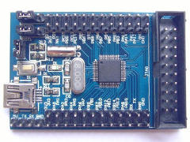

i2c-star - A STM32 based clone of the i2c-tiny-usb
==================================================

i2c-star is a compatible clone of Till Harbaum's i2c-tiny-usb. The firmware
has no software in common with Till's implementation but is compatible with
the i2c-tiny-usb driver found in the mainline Linux kernel. As a result
it will work out of the box without requiring any special software on the
host computer.

Quickstart
----------

- Install gcc-arm-embedded compiler toolchain (or similar arm-none-eabi-
  compiler).
- +make+
- +make -C src/bootloader flash+
- +make -C src/i2c-stm32f1-usb flash+

To flash the bootloader an STLink v2 must be connected to the target
boards JTAG/SWD socket.

To flash the main firmware the microcontroller must be connected to the
host using its own USB socket.

Hardware setup
--------------

The firmware can be easily ported by has been tested on an small STM32F103C8T6
based breakout board. Connections required are:

- USB to host computer
- B7: I2C bus SDA and B6: I2C bus SCL (don't forget pull up resistors)
- [Optional; debug only] PA9: UART TX and PA10: UART RX

Example hardware
----------------

[http://www.lctech-inc.com/Hardware/Detail.aspx?id=0172e854-77b0-43d5-b300-68e570c914fd[ARM Cortex-M3 STM32F103C8T6 STM32 core board development board] manufactured by http://www.lctech-inc.com[Shenzhen LC Technology (LCTech)]:

