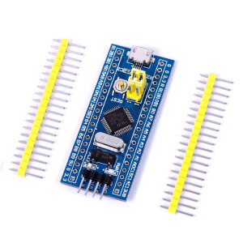

i2c-star - A STM32 based clone of the i2c-tiny-usb
==================================================

i2c-star is a compatible clone of Till Harbaum's i2c-tiny-usb. The firmware
has no software in common with Till's implementation but is compatible with
the i2c-tiny-usb driver found in the mainline Linux kernel. As a result
it will work out of the box without requiring any special software on the
host computer.

Quickstart
----------

- Install gcc-arm-embedded compiler toolchain (or similar arm-none-eabi-
  compiler), openocd and dfu-util.
- Clone this repo:
  +git clone https://github.com/daniel-thompson/i2c-star.git+
- Fetch the libraries:
  +cd i2c-star; git submodule update --init --recursive+
- Build the firmware:
- +make+
- Use a JTAG/SWD programmer to install the booloader. Either
  +make -C src/bootloader flash+ for STLink v2 or
  +make -C src/bootloader BMP_PORT=/dev/ttyACM0 flash+ for a Black Magic Probe.
- Use the bootloader to install the main application using the microcontroller
  board's own USB socket:
  +make -C src/i2c-stm32f1-usb flash+

Examples
--------

Note that the +i2c_dev+ kernel module needs to be loaded before using any of the
+i2c-tools+ utilities.

    $ i2cdetect -l
    ...
    i2c-7   unknown         i2c-tiny-usb at bus 001 device 031      N/A

    $ i2cdetect -y 7

To make Linux aware of I2C devices on the bus, use the following command:

    $ echo tmp102 0x48 | sudo tee /sys/class/i2c-adapter/i2c-7/new_device

Where +tmp102+ is the name of the kernel driver you want to associate with the
I2C device, +0x48+ is the I2C device's 7-bit address, and +i2c-7+ is the bus
number the kernel assigned to the i2c-star adapter (appears as +i2c-tiny-usb+
in +dmesg+ and +i2cdetect+).

Hardware setup
--------------

The firmware can be easily ported but has been tested on an small STM32F103C8T6
based breakout board. Connections required are:

- USB to host computer
- B7: I2C bus SDA and B6: I2C bus SCL (don't forget pull up resistors)
- [Optional; debug only] PA9: UART TX and PA10: UART RX

It has also been tested on the STM32F4-Discovery board, where no connections
(except for USB) are required because this board has I2C peripherals built in

Example hardware
----------------

http://item.taobao.com/item.htm?spm=a1z10.1.w4004-386456545.4.3eifcC&id=22097803050[STM32F103C8T6 microcontroller development board] from vcc-gnd.com. Normally very easy to source on eBay.

